<!-- ─────────────────────────────────────────────────────────────────────────────
     Agent-Harness — registry README
     Palette  #08090C · #101218 · #E3B778 · #C98A4B · #7C5CFF · #F5F2EA

     Every image below is a repo-hosted SVG regenerated by agent-harness/render.mjs.

     Why images and not styled HTML: GitHub strips <style>, <script> and custom
     class attributes out of README markdown before rendering, so a README cannot
     carry its own CSS. The one thing it will render is an  pointing at a real
     file in the repo. Relative paths resolve against the branch, raw.githubusercontent
     serves the SVG with an image content type, and SMIL animation plays inside an
      (scripts do not, which is exactly why the artwork is SMIL and not JS).
     That is the whole mechanism — there is no trick beyond it.

     Regenerate:  CORPUS_ROOT="$PWD/agent-harness" node agent-harness/render.mjs
     ───────────────────────────────────────────────────────────────────────────── -->

<div align="center">
  
</div>

<div align="center">
  
</div>

<br />

<p align="center">
  <a href="LICENSE"></a>
  
  
  
</p>

<!-- ─────────────  LIVE  ─────────────
     The row below is fetched when the page is rendered, not when this file was
     committed. shields.io pulls agent-harness/data/summary.json (2.4 KB) and reads
     one field out of it, so these numbers cannot rot the way hard-coded text does.

     What that does *not* buy is fresher data. The JSON is only rewritten when the
     collector runs, so a badge is at best as current as the last collect. Live
     fetch, scheduled data — the fetch is immediate, the data is not. Reaching
     further back would mean running the collector more often, and search allows
     only 30 requests a minute, so a full pass already takes minutes.

     Layer and project paths are keyed by id, never by array index. $.layers.0.count
     would resolve to a different layer the moment two layers swapped rank, and a
     badge showing a confidently wrong number looks exactly like one showing a
     right one. -->

<p align="center">
  
  
  
  
  
  
</p>

<p align="center"><sub>The first five are fetched live from <a href="agent-harness/data/summary.json"><code>data/summary.json</code></a>; the last is fetched live from GitHub. All six reflect the last collect, not the current second.</sub></p>

<br />

<p align="center">
  <b>A registry that regenerates itself four times a day.</b><br />
  <sub>Discover → diff → enrich → classify → record → render → commit. No database, no server, no dependencies.</sub>
</p>

<br />

<div align="center">
  
</div>

## The corpus

<div align="center">
  
</div>

The six highest-starred projects in the registry, ranked against each other
rather than against GitHub as a whole. Every tile carries the metadata the
collector actually resolved — language, stars, assigned layer, licence — and the
percentile is computed from the corpus, so it moves as the corpus moves. At this
size the top six are all inside the top one percent, which is why every tile
reads the same: the measure is honest but coarse.

The same six projects, but fetched from GitHub when this page is rendered rather
than read out of our own snapshot. These are the only numbers in this file that
do not wait for the next collect:

| Project | Live stars | Live last commit |
|---|---|---|
| [affaan-m/ECC](https://github.com/affaan-m/ECC) |  |  |
| [Significant-Gravitas/AutoGPT](https://github.com/Significant-Gravitas/AutoGPT) |  |  |
| [langgenius/dify](https://github.com/langgenius/dify) |  |  |
| [DietrichGebert/ponytail](https://github.com/DietrichGebert/ponytail) |  |  |
| [Graphify-Labs/graphify](https://github.com/Graphify-Labs/graphify) |  |  |
| [thedotmack/claude-mem](https://github.com/thedotmack/claude-mem) |  |  |

<p align="center"><sub>Read this as a live view of six named projects, not as a live ranking: the names are pinned here, so a project that fell out of the top six would still appear. The ranking above is the one that tracks the corpus. Expect the stars here to disagree with the stars in the tiles — that disagreement is the point. The tile is the snapshot; the badge is now.</sub></p>

Note what is *not* done here: no badge reads a position out of an array.
`$.top.0.stars` would be a live number that silently starts describing a
different project the first time the ranking moves, and a confidently wrong
number is worse than a missing one — nothing about it looks broken. Project
names are pinned in the table above, and the registry's own arrays are addressed
by key or not at all.

### How to actually look at it

Three routes, and they are not interchangeable:

| Route | What you get |
|---|---|
| [`data/index.md`](agent-harness/data/index.md) | Every project as markdown tables grouped by layer, one page. **GitHub renders this one**, so it works with no setup, no host and no third party. |
| GitHub Pages | The real UI — the whole registry as a single self-contained page. Driven by [`.github/workflows/pages.yml`](.github/workflows/pages.yml); needs Pages switched on once in repository settings. |
| [`site/index.html`](agent-harness/site/index.html) | The source of that page. GitHub shows it as text, and `raw.githubusercontent.com` serves it as `text/plain`, so this link will never render. Kept because the file is the artefact. |

That third row is not a bug and not fixable. GitHub will not execute HTML out of a
repository blob, because doing so would let any repository run script on
`github.com`. Markdown is rendered; HTML is served as source. A rendered page
therefore needs a host, and Pages is the one that ships with GitHub.

Why Pages is deployed by a workflow rather than from a branch: a branch source can
only publish the repository root or a `/docs` folder, and the site lives at
`agent-harness/site/`. The workflow also triggers on the registry workflow
*completing*, not only on a push, because the registry commits with `[skip ci]` —
which suppresses every workflow for that push, including the one that would
publish the new site.

Machine-readable, the whole registry is one file:
[`data/projects.json`](agent-harness/data/projects.json). A 2.4 KB
[`data/summary.json`](agent-harness/data/summary.json) carries just the scalars the
badges on this page read.

<div align="center">
  
</div>

## The layer taxonomy

<div align="center">
  
</div>

<p align="center"><sub>The constellation <em>is</em> the legend: one satellite per populated layer, radius scaled to population, count inside the node, packets travelling the spokes.</sub></p>

Classification is weighted pattern matching over topics, description, README,
manifests and workflow files — not a model call.

<p align="center">
  
  
  
  
  
  
  
  
  
</p>

<p align="center"><sub>Fetched live, so these cannot drift out of step with the registry. <code>other</code> is absent by design — see below.</sub></p>

| Layer | What lands here |
|---|---|
| Orchestration | multi-agent coordination, workflow and state machines |
| Tools & MCP | tool servers, function calling, protocol adapters |
| Memory & Context | vector stores, context windows, retrieval, state |
| Eval & Tracing | benchmarks, observability, tracing, replay |
| Governance | policy, guardrails, permissioning, audit |
| Sandboxing | microVMs, gVisor, containers, isolation boundaries |
| Runtime | execution loops, agent loops, durable execution |
| Protocols | MCP, A2A, agent-to-agent wire formats |
| Model Gateway | routing, provider abstraction, rate limiting |

**Read the distribution honestly.** As of the 2026-09-19 run, orchestration, tools
and memory held 835 of the 993 projects that were actually placed — 84% of the
classified corpus — while the four smallest layers together held 66. Concentration
is expected in a corpus built from self-applied topics; the uncomfortable number
is `other`.

`other` was the third-largest bucket at 161 projects. Fourteen percent of the
corpus cleared the relevance gate and then matched no layer at all. That is either
a real property of the ecosystem or a failure of the classifier, and the current
design cannot tell you which, because it is measuring vocabulary rather than
capability. It is the strongest argument for the seed-based expansion below.

`other` is a catch-all bucket, not a harness layer, so it is excluded from the
constellation, from the badges above, and from every "N layers" claim in the
artwork.

<div align="center">
  
</div>

## What it produces

| Surface | Path | Use |
|---|---|---|
| Machine-readable state | `data/projects.json` | the API |
| Compact live endpoint | `data/summary.json` | 2.4 KB — the scalars README badges fetch |
| This repo's own traffic | `data/traffic.json` | views and clones, accumulated across runs |
| Embeddable cards | `assets/cards/<owner>-<repo>.svg` | one SVG per project |
| Browsable registry | `site/index.html` | self-contained, no CDN, no build step — published via Pages |
| Markdown directory | `data/index.md` | grouped by layer; renders natively on GitHub |
| Append-only history | `history/` | per-project timelines, event stream, hash-chained runs |

Every card and every row records the commit SHA and classifier version it was
derived from, so any render can be reproduced byte for byte.

---

## Why a registry, not a list

A hand-curated list rots, carries no history, and cannot be verified. An entry
from three years ago tells you a project was interesting once; it cannot tell you
when it was last pushed, whether it is archived, or what its stack looked like
last month.

This registry is regenerated four times a day. Every change is a commit you can
diff, every observation is appended rather than overwritten, and the corpus is
re-derived from a public index instead of from someone's memory.

---

## How it works

```
discover ──▶ diff ──▶ enrich ──▶ classify ──▶ record ──▶ render ──▶ commit
  │           │         │           │           │
  │           │         │           │           └─ append-only JSONL + hash chain
  │           │         │           └─ 9-layer taxonomy, deterministic
  │           │         └─ GraphQL nodes(ids:) + object(expression:"HEAD:…")
  │           └─ skip anything whose search row is unchanged
  └─ 12 overlapping search queries, unioned and de-duplicated by node id
```

### The numbers that shaped the design

The corpus is real and it was measured before anything was built:

| Query | Repositories |
|---|---:|
| `topic:agent-harness` | **1,222** |
| `topic:agent-framework` | 2,664 |
| `"agent harness"` in name/description | **7,978** |
| `topic:agent-runtime` | 909 |
| `topic:ai-agents` | 94,547 *(too broad to use directly)* |

The binding constraint is not the one you would guess:

| API | Limit | Verdict |
|---|---|---|
| **Search** | **30 requests / minute** | **the scarce resource** |
| GraphQL | 5,000 points / hour | plentiful |
| REST core | 5,000 requests / hour | unused |

Search also caps at **1,000 results per query**, so no single topic can cover the
corpus. Queries are overlapping and unioned by node id instead.

Measured enrichment cost from a real run: **153 repositories for 120 GraphQL
points — about 0.78 points each.** A full 1,500-project sweep costs roughly 1,200
points, a quarter of one hour's budget. Manifests ride along in the same GraphQL
call as the metadata via `object(expression: "HEAD:package.json")`, so stack
detection needs no clone and no extra request.

### The optimisation that makes "real time" a non-question

**The search index is the change detector; GraphQL is the expensive enrichment.**

Search rows already carry stars, push time and archived status, so a repository
whose row is unchanged is skipped entirely. Steady-state cost becomes proportional
to **churn, not corpus size**.

That retires the original "real time" question rather than answering it. Webhooks
look like the obvious design and are the wrong one: a ~10 second delivery timeout,
no guaranteed retry, and a three-day redelivery window mean webhooks still need an
always-on endpoint plus a reconciler. Once enrichment is incremental, moving from
twice a day to every six hours is a cron expression, not a rewrite.

The workflow ships at every six hours, with a weekly full re-enrichment to catch
stack drift the search index cannot see.

---

## Repository layout

```
agent-harness/
  collect.mjs              discovery → diff → enrichment → classification → history
  render.mjs               SVG cards, markdown directory, the registry site, README assets
  config/sources.json      corpus definition, thresholds, tuning knobs
  workflows/registry.yml   Actions workflow: 6-hourly, weekly full, allowlist + chain checks
  workflows/pages.yml      Actions workflow: publishes site/ to GitHub Pages
  data/                    derived state — the API
  assets/cards/            one embeddable SVG per project
  assets/*.svg             README artwork: banner, stats, mesh, featured, divider
  site/index.html          the browsable registry
  history/                 append-only timelines, event stream, hash-chained runs
  README.md                full design notes
```

`profile-cards/` sits alongside it: the same technique extracted and applied to a
single account, where the collector pattern was proven first.

---

## Where this is genuinely hard

### 1. Relevance cannot be solved with keywords

Topics are self-applied and unreliable. A project can carry `topic:agent-harness`
and still be a chat-with-your-docs app. Star count is not relevance either — the
highest-starred repository in the raw corpus is a document-QA tool.

The weighted harness-vocabulary gate works, but it is the weakest part of the
system and should not be treated as the definition of the corpus. Across the 153
repositories from one query the score spreads 8–54, and a document-QA tool still
scores 23, because the vocabulary overlaps almost completely: both kinds of
project say *agent*, *tool*, *context*, *memory*.

The shipped corpus shows the same failure from the other direction: AutoGPT — an
autonomous agent loop by any reasonable reading — is assigned `other`, and `other`
ends up the registry's third-largest bucket. The gate is measuring vocabulary, not
capability.

The real fix is **seed-based expansion**: curate roughly 40 unambiguous seed
projects, then expand using signals that are hard to game — shared contributors,
dependency edges, co-mention in seed READMEs. The keyword gate stays as a cheap
pre-filter, not as the definition.

### 2. A deterministic agent is not achievable; deterministic controls are

There is no model in this pipeline, and that is deliberate. Classification is
pattern matching, so `card = f(commit_sha, classifier_version)` reproduces
exactly, and every card records both.

Guaranteed: bounded writes enforced twice and failing closed, canonical
serialisation, change-gated commits, a hash-chained run log, deterministic
ordering. Not guaranteed, and not claimed: that a scheduled run fires on time, or
that a registry with a language model in the loop would be reproducible.

---

## Governance

Proportionate to the scale — this is a public read-only registry, not a
production control plane.

| Control | Implementation |
|---|---|
| Bounded writes | `WRITE_ALLOWLIST` in the collector, re-checked in CI before commit |
| Fail closed | an unexpected path aborts the run; no partial commits |
| Change gating | byte comparison; timestamps stamped only on real change |
| Rate-limit safety | search budget paced and enforced; fails loudly rather than throttling |
| Tamper evidence | hash-chained run log, verified on every run |
| Reproducibility | commit SHA + classifier version recorded per card |

**Branch protection on `main` — no force-push, no deletion — is required for the
append-only claim to hold.** Without it, "append-only history" describes git's
defaults rather than a guarantee. Git history is the tamper-evident log; branch
protection is what makes it one.

---

## Compliance

A registry like this is **minimal risk** under the EU AI Act — not an Annex III
system — so it should not be built to the high-risk bar. Annex III obligations
moved to 2 December 2027 under the Digital Omnibus (Reg (EU) 2026/1744); Annex I
to 2 August 2028.

The deadline that has actually passed is the **Cyber Resilience Act's reporting
duty, live since 11 September 2026**. The SBOM it expects is the same manifest
data the collector already fetches, which makes that roadmap item close to free.

---

## Cost

| | |
|---|---|
| Search requests | ≤ 34 per run, paced against a 30/min ceiling |
| GraphQL points | ≈ 0.78 per enriched repository |
| Steady state | proportional to churn |
| Runner minutes | ~4 min × 4/day ≈ 500/month |
| Free tier | 2,000 minutes/month — fits comfortably |

The steady-state figure is not the cold-start figure, and the difference is large
enough to matter against a 25-minute job timeout. The first run that actually
reached Collect enriched **1,786 of 1,831 candidates in 19 minutes**, because the
committed state held only the projects that had already passed the relevance gate —
so almost nothing was recognised as unchanged. Once the full corpus is committed
the diff has something to work with and later runs are proportional to churn. Worth
knowing before concluding the pipeline is slow.

There is no database, no server and no card-rendering service. The repository is
the store; `raw.githubusercontent.com` or jsDelivr is the CDN. Nothing draws the
artwork except `render.mjs`.

One external dependency is accepted, and it is confined to the live badges:
shields.io fetches `data/summary.json` and the GitHub API when a badge image is
requested. If shields is unreachable those badges fail and the rest of this page
still renders, because every other image is served from this repository. That is
the trade being made — the badges are live, and liveness is not something a static
file can provide on its own.

---

## Using the data

```
https://raw.githubusercontent.com/<owner>/<repo>/main/agent-harness/data/projects.json
https://cdn.jsdelivr.net/gh/<owner>/<repo>@main/agent-harness/data/projects.json
https://raw.githubusercontent.com/<owner>/<repo>/main/agent-harness/data/summary.json
```

`summary.json` exists for one job: being small enough to fetch on every page view.
It carries the totals, the per-layer counts keyed by layer id, the top eight
projects, and this repository's own traffic totals. Layers are an object rather
than an array so a consumer can address one by a path that cannot move —
`$.layers.orchestration.count` is orchestration's count forever, whereas an index
would silently point elsewhere the first time two layers swapped rank. The same
reasoning is why `traffic.visitorDays` is not called `traffic.visitors`: it sums
per-day distinct counts, which is not a count of distinct people.

Reading one field out of it, which is what a live badge does:

```
https://img.shields.io/badge/dynamic/json
  ?url=<url-encoded summary.json>
  &query=$.projectCountLabel
  &label=projects&color=101218&style=for-the-badge
```

Embedding a card, which stays current because the SVG is regenerated:

```markdown
[](https://github.com/owner/repo)
```

Fields in `data/projects.json`: identity and URL, stars, forks, open issues,
license, created/pushed/updated timestamps, default branch and HEAD commit,
latest release, languages with colours, detected stack, harness signals, assigned
layer and layer scores, relevance score, discovered-via provenance.

---

## Running it locally

```bash
export GITHUB_TOKEN=...          # fine-grained PAT, public read is enough
cd agent-harness
node collect.mjs                 # discover, enrich, classify, record
node render.mjs                  # cards, markdown, site, README artwork
open site/index.html
```

Tuning lives in `config/sources.json`: `qualityFloor` (minimum stars),
`minRelevance` (harness-vocabulary gate), `maxProjects`, and the refresh tiers.
`--only-query <label>` runs a single discovery query while iterating.

Both scripts resolve their corpus root from `git rev-parse --show-toplevel`, not
from the working directory. Set `CORPUS_ROOT` to point them at a specific
checkout — the CI workflow does exactly this, because the registry lives in a
subdirectory of this repository.

---

## Roadmap

1. **Seed-based corpus expansion** — the relevance fix described above, and the
   answer to the two empty layers.
2. **Star velocity leaderboards** — the deltas are already in
   `history/events.jsonl`; a render change, not a collection change.
3. **Trend detection** — flag projects crossing a velocity threshold. The signal a
   static list structurally cannot produce.
4. **CycloneDX SBOMs** — reuses manifests already fetched; serves CRA reporting.
5. **GitHub Pages** — the workflow is in `.github/workflows/pages.yml`; it needs
   Pages enabled once under Settings → Pages with the source set to *GitHub
   Actions*, after which every successful registry run republishes the site.
6. **Require the validation check** — branch protection on `main` is already on
   (no force pushes, no deletions, linear history, admins included), but GitHub
   will not let a status check be required until it has run at least once. Add
   `Validate the rendered artefacts` to the required checks once this workflow
   has a green run on `main`.

---

## License

Code: MIT — see [`LICENSE`](LICENSE). Data in `data/` and `history/` is derived
from public GitHub metadata; each project remains under its own licence, recorded
per row as `license`.

<div align="center">
  
</div>

<br />

<p align="center">
  <b>The numbers about this repository are collected the same way as the numbers about everything else here.</b><br />
  <sub>Four times a day, by the same pipeline, into a file you can read.</sub>
</p>

<p align="center">
  
  
  
  
</p>

<p align="center"><sub><code>views</code> is a cumulative sum, so adding days up is meaningful. <code>visitor-days</code> is not a headcount: it sums GitHub's per-day distinct counts, so one person returning on three days counts three times, and it is named <code>visitor-days</code> precisely so it cannot be read as <code>visitors</code>. GitHub's traffic API keeps only a fourteen-day window, so the totals start when collection started and would lose any gap longer than a fortnight. It is GitHub's own measurement, needs no third party, and is why this page does not carry a hit counter that increments on every crawler.</sub></p>
